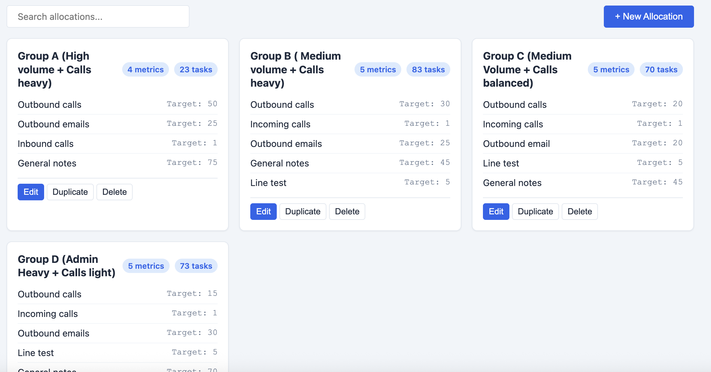
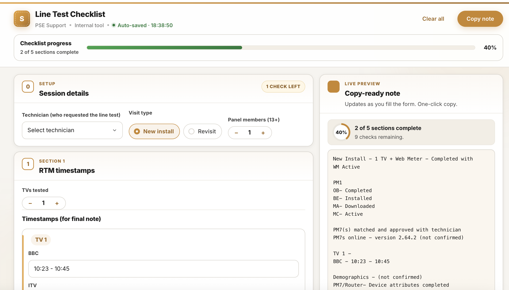
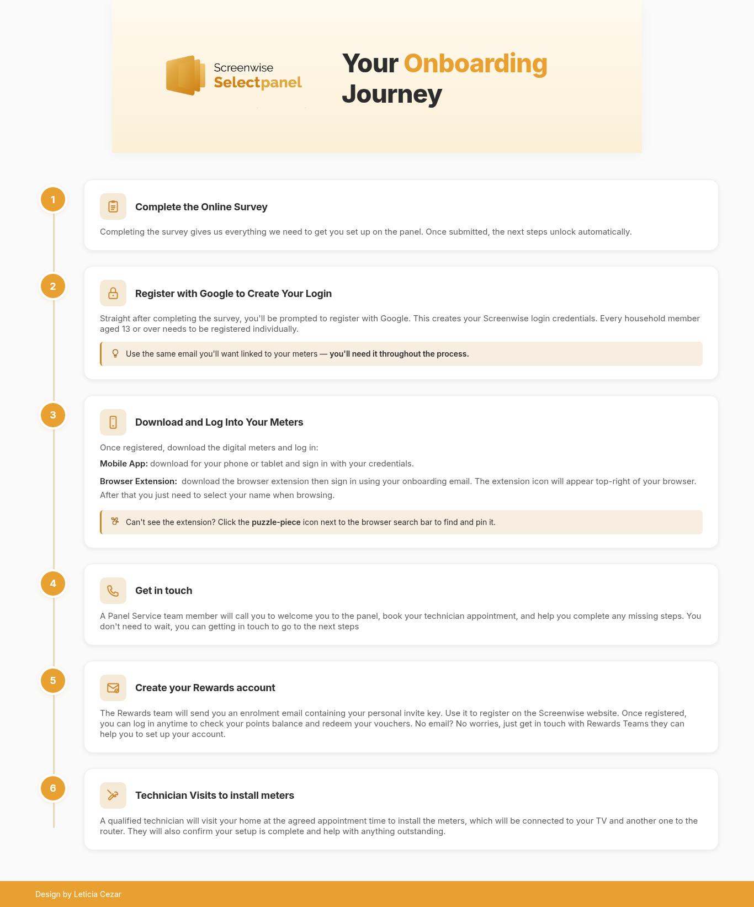
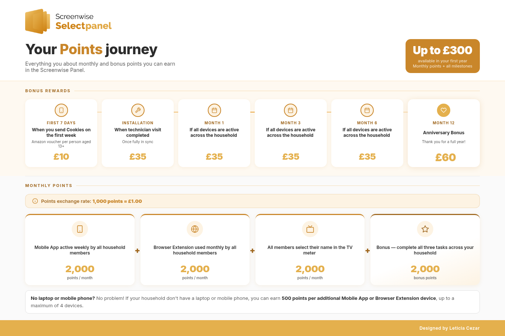

<!DOCTYPE html>
<html lang="en">
<head>
<meta charset="UTF-8">
<meta name="viewport" content="width=device-width, initial-scale=1.0">
<title>Leticia Cezar — Operations & Internal Tools</title>
<meta name="description" content="Leticia Cezar — operations and process improvement. I build internal tools, often with AI, that cut admin and make work easier for teams.">

<link rel="preconnect" href="https://fonts.googleapis.com">
<link rel="preconnect" href="https://fonts.gstatic.com" crossorigin>
<link href="https://fonts.googleapis.com/css2?family=Space+Grotesk:wght@400;500;600;700&family=Inter:wght@400;500;600;700&display=swap" rel="stylesheet">
<link rel="stylesheet" href="https://cdnjs.cloudflare.com/ajax/libs/font-awesome/6.5.0/css/all.min.css">

</head>
<body id="top">

<!-- ========== NAV ========== -->
<nav class="nav">
  

    <a href="#top" class="brand">LC Leticia Cezar</a>
    

      <a href="#about">About</a>
      <a href="#work">Work</a>
      <a href="#contact" class="nav-cta">Get in touch</a>
    

    <button class="nav-toggle" id="navToggle" aria-label="Toggle menu"><i class="fa-solid fa-bars"></i></button>
  

</nav>

<!-- ========== HERO ========== -->
<header class="hero">
  

    

       Available for full-time roles
      <h1>I build internal tools that make work easier.</h1>
      
Operations &amp; process improvement — I spot the friction, figure out what's missing, and build something that removes it.

      
<b>Operations + process improvement, often using AI to build internal tools</b> that cut admin and give teams clarity.

      

        <a href="#contact" class="btn btn-primary"><i class="fa-solid fa-envelope"></i> Email me</a>
        <a href="#work" class="btn btn-ghost">See the work <i class="fa-solid fa-arrow-down"></i></a>
      

      

        <i class="fa-solid fa-location-dot"></i> London · Remote / Hybrid
        <i class="fa-solid fa-language"></i> English · Portuguese
      

    

    

      

      
<b>Self-taught</b>builder &amp; lifelong learner

    

  

</header>

<main>

<!-- ========== ABOUT ========== -->
<section id="about" class="section about">
  

    

      

        About
        
I'm Leticia — I make work better for the people doing it, and for the company they do it for.

        
My work sits in the operational layer that keeps research, support, and delivery connected. I'm <b>self-taught</b>, I love to learn, and I'm happiest when I've turned a messy manual process into something that just works.

        
That looks like mapping how work actually happens, spotting the gaps, and building the tool that closes them — internal apps, process maps, infographics, and AI-powered workflows that fit the way a team really works.

        

          <i class="fa-solid fa-chart-line"></i> Data &amp; Analysis
          <i class="fa-solid fa-screwdriver-wrench"></i> Internal Tools
          <i class="fa-solid fa-wand-magic-sparkles"></i> AI Workflows
          <i class="fa-solid fa-people-arrows"></i> Cross-team Ops
        

      

      

        

<i class="fa-solid fa-lightbulb"></i>

<h4>Knowledgeable</h4>
I design the metrics and the logic, not just the interface.

        

<i class="fa-solid fa-circle-check"></i>

<h4>Competent</h4>
I ship real, working tools that teams use day to day.

        

<i class="fa-solid fa-compass"></i>

<h4>Resourceful</h4>
I taught myself to build, so a missing tool is never a dead end.

      

    

  

</section>

<!-- ========== WORK ========== -->
<section id="work" class="section">
  

    

      Selected work
      <h2>Tools I've built &amp; shipped.</h2>
      
Internal products built to solve real, day-to-day operational problems. Open any one to see the thinking — the friction, what I built, and what changed.

    

    

      <!-- FEATURED: KPI Calculator -->
      

        

          01
          

            <i class="fa-solid fa-star"></i> Featured
            <h3>KPI Performance Calculator</h3>
            
End-to-end: I designed the metrics &amp; logic, then built the tool.

            
Metrics designJavaScriptInternal tool

          

          Read <i class="fa-solid fa-chevron-down"></i>
        

        

          

            

              
<h5>The friction</h5>
Team leaders were spending real time pulling weekly numbers by hand, and employees only heard how they were performing in occasional reviews — never day to day. Feedback was slow, manual, and easy to misread.

              
<h5>What I built</h5>
I developed the performance metrics and the calculation logic from scratch, then built an HTML internal tool around them. It turns weekly panel metrics into a single, clear performance score against target — no spreadsheet wrangling.

              
<h5>What changed</h5>
Leaders lost the manual admin, and employees got daily, easy-to-understand feedback they could act on themselves. The thinking and the build were both mine — the metric design is what makes the score actually mean something.

              
<a class="btn btn-dark" href="../9- KPI Performance/index.html" target="_blank" rel="noopener">Open the tool <i class="fa-solid fa-arrow-up-right-from-square"></i></a>

            

            

          

        

      

      <!-- Line Test Checklist -->
      

        

          02
          

            <h3>Interactive Line Test Checklist</h3>
            
A guided, auto-saving form that makes every handover consistent.

            
Internal toolUXOps

          

          Read <i class="fa-solid fa-chevron-down"></i>
        

        

          

            

              
<h5>The friction</h5>
The 5-stage line test for PSE Support lived in people's heads and free-text notes, so handovers were inconsistent and steps got missed.

              
<h5>What I built</h5>
A guided, auto-saving checklist that walks through each stage and turns the result into a clean, copy-ready note.

              
<h5>What changed</h5>
Every handover now follows the same structure and produces the same shape of note — less missed, less re-explaining.

              
<a class="btn btn-dark" href="../13- Line Test Support/index.html" target="_blank" rel="noopener">Open the tool <i class="fa-solid fa-arrow-up-right-from-square"></i></a>

            

            

          

        

      

      <!-- Onboarding Map -->
      

        

          03
          

            <h3>Onboarding Process Map</h3>
            
A side-by-side view of the participant journey, used to find drop-off.

            
Process mappingOnboardingCross-functional

          

          Read <i class="fa-solid fa-chevron-down"></i>
        

        

          

            

              
<h5>The friction</h5>
No one had a shared picture of the full participant onboarding journey, so it was hard to agree where people were dropping off.

              
<h5>What I built</h5>
A side-by-side visual map of the journey from survey submission through compliance, laid out so each stage is comparable at a glance.

              
<h5>What changed</h5>
Ops, Engineering, and Research could finally point at the same map — making drop-off points and ownership obvious.

              
<a class="btn btn-dark" href="../7-onboarding-mapping/screenwise-onboarding-side-by-side.html" target="_blank" rel="noopener">Open the map <i class="fa-solid fa-arrow-up-right-from-square"></i></a>

            

            

          

        

      

      <!-- Infographics -->
      

        

          04
          

            <h3>Explainer Infographics</h3>
            
Turning rewards, processes &amp; policy into clear, shareable visuals.

            
Data vizCommsDesign

          

          Read <i class="fa-solid fa-chevron-down"></i>
        

        

          

            

              
<h5>The friction</h5>
Panel rewards and policies were written as dense text, so participants and stakeholders often misread how points and bonuses worked.

              
<h5>What I built</h5>
Visual explainers — like the Screenwise Points Guide — that translate the rules into clear, shareable graphics.

              
<h5>What changed</h5>
One image now does the job a paragraph couldn't, cutting the back-and-forth and making the rules easy to share.

            

            

          

        

      

    

  

</section>

<!-- ========== CONTACT ========== -->
<section id="contact" class="section contact">
  

    

      Contact
      <h2>Let's make something work better.</h2>
      
Looking for a full-time role where operations, tooling, and delivery actually matter. The fastest way to reach me is email — I reply the same day.

    

    

      <button type="button" class="btn btn-primary email-copy" id="emailCopy" data-email="leticiafcezar@gmail.com" aria-label="Copy email address">
        <i class="fa-solid fa-envelope ic ic--default"></i>
        <i class="fa-solid fa-copy ic ic--hover"></i>
        <i class="fa-solid fa-check ic ic--done"></i>
        leticiafcezar@gmail.com
      </button>
      <a href="https://www.linkedin.com/in/leticiafcezar/" class="btn btn-ghost" style="color:#fff;border-color:rgba(255,255,255,.28)" target="_blank" rel="noopener"><i class="fa-brands fa-linkedin-in"></i> LinkedIn</a>
    

    

      <a class="soc" href="mailto:leticiafcezar@gmail.com" aria-label="Email"><i class="fa-solid fa-envelope"></i></a>
      <a class="soc" href="https://www.linkedin.com/in/leticiafcezar/" target="_blank" rel="noopener" aria-label="LinkedIn"><i class="fa-brands fa-linkedin-in"></i></a>
    

  

</section>

</main>

<footer class="footer">
  

    
<b>Leticia Cezar</b> — Operations &amp; Internal Tools

    
● available &nbsp;·&nbsp; v2026.06

  

</footer>

<button class="to-top" id="toTop" aria-label="Back to top"><i class="fa-solid fa-arrow-up"></i></button>

</body>
</html>